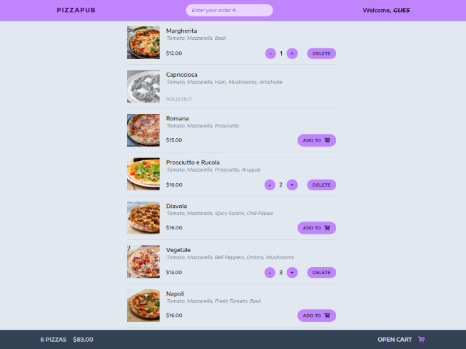

# PizzaPub react/redux-toolkit app

## With an app you can choose, add and order your some of your favorite pizzas.

### Getting Started

To get started with pizzapub, you will need to have Node.js and Vite installed on your machine.

To install Node.js, visit the Node.js website: https://nodejs.org

To install Vite, run the following command in your terminal:

```
npm install -g vite
```

Once you have Node.js and Vite installed, you can clone the pizzapub repository to your local machine:

```
git clone https://github.com/bakna2t/pizzapub.git
```

Navigate to the pizzapub directory and install the dependencies:

```
cd pizzapub
npm install
```

To start the development server, run the following command:

```
npm run dev
```

The development server will be running on http://localhost:5173. You can open this URL in your web browser to view the pizzapub app.

click here to visit => [_**PizzaPub**_](https://pizzapub.vercel.app/)

---

<div align="center">
    <p style="width: 500px;">
        <a href="https://pizzapub.vercel.app/" target="_blank" >
            
        </a>
    </p>
</div>
